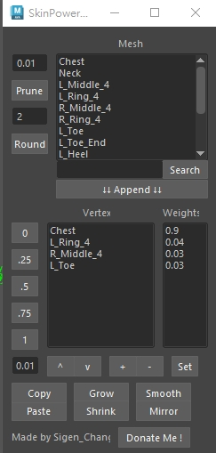
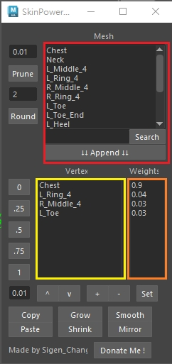
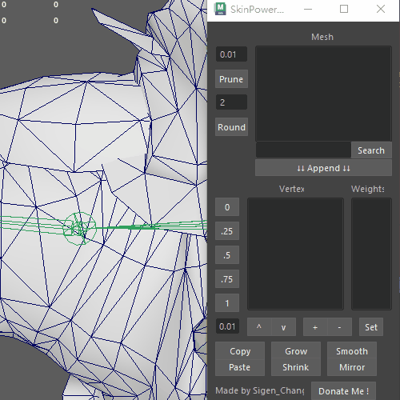
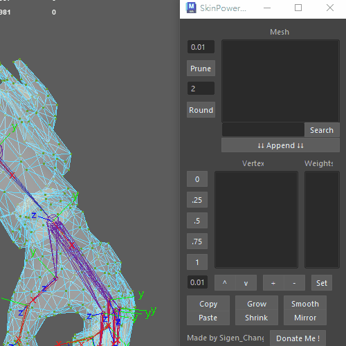

# SkinPowerTool
[](https://www.firsttimersonly.com/)




As a replacement tool for the SkinMagic plugin for Maya versions prior to 2022, it has been rewritten using Python 3.


## Improvements and Differences Compared to Skin Magic

- All operations are based on Maya's vertex editing mode.
- Supports Maya versions 2023 and above.
(Maya 2022 can still use Skin Magic with Python 2)
- Object-oriented design, scripts are categorized by functionality.
- Integrated UI, reducing the need to open additional windows, and providing a .ui file for easy modification.
- Simplified UI, eliminating buttons that are rarely used in practice.
- Smooth algorithm now uses Maya's default functions.
- Provides functionality to remove trailing decimal places.

## Installation

```python
import sys

modules_path = r"D:\\your\\path\\SkinPowerTool"
sys.path.append(modules_path)
exec(open(modules_path + r'\main.py',encoding="utf-8").read())
```
Copy the code into the Python tab of the Maya script editor.

Change the `modules_path` to your specific path where the script is located, and retain the 'r' character like this:

```python
modules_path = r"D:\Maya\plug-ins\tools\SkinPowerTool"
```

Press the execute code button, or you can set this script as a shelf button for easy future access.

## Features

**Note: All operations are based on Maya's vertex editing mode. Please ensure you are in vertex mode before executing any actions.**



**(Red) , Mesh:**  
Lists all the influence names on the mesh.

**(Yellow) , Vertex:**  
Names of effective influences on the vertex, this list will automatically ignore influences with a weight of 0. You need to select the name from this list when editing.

**(Orange) , Weights:**  
Weights corresponding to the vertex list.

***Editing Area:***  
The numeric buttons allow you to `assign` the weight of the button's number directly.

The red line window allows you to enter custom values, with `^` and `v` buttons for adjusting the custom values.

`+` and `-` can increase or decrease the weight on `selected influences` from the vertex list.

`Set` directly `assigns` a weight.

`Smooth` performs weight smoothing.

`Copy` can copy weights from a single vertex.

`Paste` can apply copied weights to multiple vertices.

`Grow` and `Shrink` can expand or reduce the selection of vertices.

`Mirror` can mirror the selected vertices (ensure symmetric selection, default YZ axis).

***Prune:***  
Used for deleting weights below a specified value.

***Round:***  
Rounds off weights for selected vertices, trimming the decimal places beyond the specified number, defaults to 2 decimal places.
(Using this feature may result in minor differences in weight values.)

***Extra Features***

Above the `Append` button is a search field for the mesh list. Enter text and press enter to search.
Select a name from the mesh window, then press `Append` to add the name to the vertex list for influence editing.

## Basic Workflow

1. Enter Vertex editing mode.
2. Select vertices.
3. Select influence name.
4. Edit weights.
5. Repeat from step 2.



## Search and Add to List 

1. Enter Vertex editing mode.
2. Select vertices.
3. Enter text to search.
4. Select a name from the Mesh list.
5. Press Append to add to Vertex list.
6. Select influence name.
7. Edit weights.



## Cautionary Notes

Avoid using the `Round` function on a large number of vertices. In its current implementation, testing on a computer with an i7-12700, 32GB RAM, and RTX 3060ti 24GB took approximately 250 seconds for a mesh with 45,000 vertices and 93 joints.

While `Round` is calculating, a progress bar will appear in the bottom left corner.

Performing operations on meshes with higher polygon counts and more joints will take longer.

## Special Thanks

I was inspired by Skin Magic, but unfortunately, it is no longer updated. So I learned Python to create this script. If you are using Maya versions prior to 2022, you can visit the Skin Magic website to support them.

(Update: Skin Magic has now been updated for py3, but comprehensive testing has not yet been conducted)
https://animbai.com/
